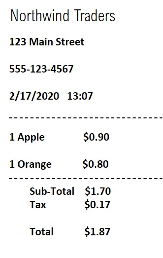

# Module 04: Extract Data from Documents 📄

## Prerequisites 📋

- Azure subscription
- Azure AI resource (from Part 1)
- Web browser

## 1. Resource Verification ✅

Before starting this lab:
1. Verify completion of Part 1
2. Ensure access to your Azure AI resource
3. Confirm your Azure AI Foundry project is accessible

## 2. Navigate to Document Intelligence 🔍

1. Go to your Azure AI Foundry project
2. Select **Vision + Document** from the left menu
3. Scroll to **Document Intelligence** section

1. Navigate to Document Intelligence:
   - Scroll down on Vision + Document page
   - Select **Document** under "View all other capabilities"
   - Click **Receipts** tile under "Prebuilt models"

2. Prepare for Analysis:
   - Verify your Azure AI resource is selected in "Try it out"
   - Download the sample receipt:
     
     [Download Sample Receipt](https://aka.ms/mslearn-receipt)

3. Process the Receipt:
   - Save the sample receipt to your computer
   - Click **Browse for files** on the Receipts page
   - Upload your saved receipt image
   

4. Analyze Results:
   - Click **Run analysis**
   - Review the extracted information:
     - Merchant details (name, address, phone)
     - Transaction information (date/time)
     - Line items
     - Financial details (subtotal, tax, total)
   - Note the confidence scores for each extracted field

⸻

## 6. Additional Exploration 🔍

Try the model with different receipt types:
- Upload receipts with various layouts
- Test receipts in different languages
- Observe how the model handles different formats

## 7. Clean Up Resources 🧹

Prevent unnecessary charges by cleaning up:

1. Go to **Resource groups** → select `ResourceGroup1`
2. Click **Delete resource group**
3. Type `ResourceGroup1` to confirm
4. Click **Delete**

## Additional Resources 📚

- [Document Intelligence Documentation](https://docs.microsoft.com/azure/applied-ai-services/form-recognizer/)
- [Azure AI Services Pricing](https://azure.microsoft.com/pricing/details/cognitive-services/)
- [Sample Code Repository](https://github.com/Azure/azure-sdk-for-python/tree/master/sdk/formrecognizer/azure-ai-formrecognizer)
